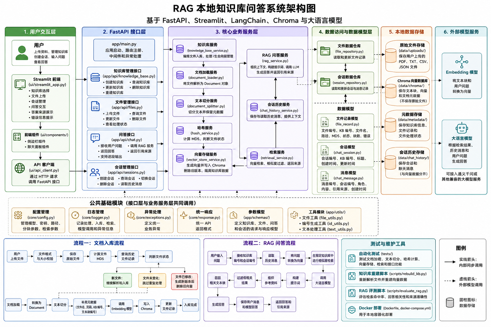

# Local RAG Chat

Local RAG Chat 是一个面向本地知识文件的问答系统工程骨架。本初始化版本已经打通 FastAPI、SQLite、文件上传和 Streamlit HTTP 调用边界，但不会加载 Embedding/LLM、解析文档或连接真实 Chroma 集合。



## 当前能力

- `GET /health` 健康检查。
- 知识库创建、列表、详情和删除；知识库包含文件或会话时拒绝删除。
- TXT、PDF、CSV、JSON 单文件安全上传，最大 20 MiB；上传后保存文件及 `PENDING` 数据库记录。
- 聊天接口返回明确的初始化占位答案，不调用模型。
- Streamlit 可查看后端状态、创建和选择知识库、上传文件并体验占位问答；后端不可用时页面仍可显示。
- 文件列表/删除和会话接口保留统一的 HTTP 501 响应；重建与评估脚本也会明确报告尚未实现。

## 架构与目录

```text
Streamlit / API Client
        ↓ HTTP
FastAPI API
        ↓
Service
        ↓
Repository
        ↓
SQLite / data/uploads
```

```text
app/                    FastAPI、业务服务、Repository 与模型
ui/                     Streamlit 页面、组件和 HTTP 客户端
data/uploads/           上传文件（运行时内容不提交 Git）
data/chroma/            预留向量数据目录
data/metadata/          SQLite 元数据目录
data/chat_history/      预留会话历史目录
scripts/                后续重建与评估命令入口
tests/                  pytest 测试
run.py                  FastAPI 本地启动入口
```

项目根目录中的另一张 PNG 是原始项目资产，初始化过程不会删除或覆盖它。

## 本地启动

需要 Python 3.11 或更高版本。

Windows PowerShell：

```powershell
python -m venv .venv
.venv\Scripts\activate
pip install -r requirements.txt
Copy-Item .env.example .env
```

Windows `cmd.exe` 也可使用：

```bat
python -m venv .venv
.venv\Scripts\activate
pip install -r requirements.txt
copy .env.example .env
```

Linux 或 macOS：

```bash
python -m venv .venv
source .venv/bin/activate
pip install -r requirements.txt
cp .env.example .env
```

启动后端：

```bash
python run.py
```

后端默认地址为 `http://localhost:8000`，Swagger 文档位于 `http://localhost:8000/docs`。

在另一个终端启动前端：

```bash
streamlit run ui/streamlit_app.py
```

前端默认地址为 `http://localhost:8501`。如后端地址不同，可设置 `API_BASE_URL`；所有 HTTP 请求都带超时，默认 3 秒。

运行测试：

```bash
pytest
```

## Docker Compose

```bash
docker compose up --build
```

Compose 使用同一个 Python 3.11.15 镜像启动两个服务：

- `backend` 暴露 `8000`，并提供健康检查。
- `frontend` 暴露 `8501`，通过 `http://backend:8000` 访问后端，等待后端健康后启动。
- `local-rag-data` 命名卷挂载到后端 `/app/data`，用于持久化上传文件与 SQLite 数据。

停止服务但保留数据卷：

```bash
docker compose down
```

请勿附加 `--volumes`，除非确实希望删除持久化数据。

## API 响应与端点

所有端点使用统一响应包络：

```json
{
  "code": 0,
  "message": "success",
  "data": {}
}
```

已实现端点：

| 方法 | 路径 | 说明 |
| --- | --- | --- |
| GET | `/health` | 健康检查 |
| POST / GET | `/api/knowledge-bases` | 创建 / 列出知识库 |
| GET / DELETE | `/api/knowledge-bases/{knowledge_base_id}` | 查看 / 删除知识库 |
| POST | `/api/files/upload` | multipart 单文件上传；字段为 `knowledge_base_id`、`file` |
| POST | `/api/chat` | 返回初始化占位答案 |

以下端点会先完成 UUID 或请求体校验，再返回结构化 HTTP 501：

- `GET /api/files?knowledge_base_id=...`
- `GET /api/files/{file_id}`、`DELETE /api/files/{file_id}`
- `POST /api/sessions`、`GET /api/sessions`
- `GET /api/sessions/{session_id}`、`DELETE /api/sessions/{session_id}`

## 配置与数据安全

复制 `.env.example` 后可调整服务、路径、分块、检索和上传参数。`ALLOWED_FILE_EXTENSIONS` 必须保持 JSON 数组格式，例如：

```dotenv
ALLOWED_FILE_EXTENSIONS='[".txt", ".pdf", ".csv", ".json"]'
```

默认分块参数为 `1000/200`、检索 Top K 为 `4`、分数阈值为 `0.5`、上传上限为 `20 MiB`。相对路径均从项目根目录解析。`.env`、日志、SQLite 文件、上传内容、Chroma 数据与会话运行数据已从 Git 和 Docker 构建上下文排除；示例配置不包含 API Key。

## 尚未实现

- 文档解析、文本切分与后台处理状态推进。
- Embedding、Chroma 写入/检索、LLM 调用和真实 RAG 答案。
- 文件列表、状态查询与删除。
- 会话持久化、历史消息和会话管理。
- 索引重建、离线评估、认证、权限和迁移系统。

`scripts/rebuild_kb.py` 与 `scripts/evaluate_rag.py` 是明确的后续入口，当前会以退出码 `2` 报告未实现，不会伪造执行结果。
